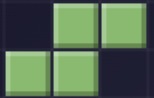
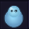

---

<table width="100%">
<tr>
<td width="50%" valign="top">

### 💫 About Me

- 🔭 &nbsp;Working on **something top secret** 🔒
- 🌱 &nbsp;Currently deep in **AI & Machine Learning**
- 🎮 &nbsp;I build retro **browser games**
- 🌐 &nbsp;Check out my site: **[stugit.github.io](https://stugit.github.io/)**
- 💬 &nbsp;Happy to chat about **full-stack, AI, or gaming**
- ⚡ &nbsp;Fun fact: I turn ☕ into commits

</td>
<td width="50%" valign="top" align="center">

### 🏆 Trophies

</td>
</tr>
</table>

---

## 💻 Tech Stack

---

## 📊 GitHub Stats

---

## 📈 Contribution Activity

---

## 🕹️ Play My Games

<table>
<tr>
<td align="center" width="50%">

### 🧱 Tetris Retro

</td>
<td align="center" width="50%">

### 📦 Sokoban Logic

</td>
</tr>
</table>

---

*⭐ If you find any of my projects useful, a star goes a long way!*

